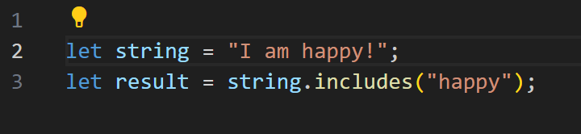
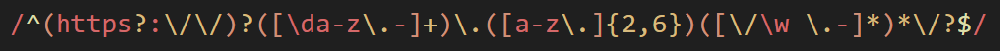

# Regular Expression Tutorial: Matching a URL

All high-level programming languages come with built-in methods that can check if a string contains a certain character or any combination of characters. For example, the following JavaScript statement will return true:
    
These methods are great; however, you need to know the exact string you are searching for. Is there a way we can do this dynamically? For instance, we would like to search the word "fast" but not "fasting". Let's introduce **regular expression**.

## Summary

A **regular expression** (shortened as **regex**) is a sequance of characters that specifies a match pattern in text. Take the following example of a regular expression, which we'll call "Matching a Url":
    

## Table of Contents

- [Anchors](#anchors)
- [Quantifiers](#quantifiers)
- [OR Operator](#or-operator)
- [Character Classes](#character-classes)
- [Flags](#flags)
- [Grouping and Capturing](#grouping-and-capturing)
- [Bracket Expressions](#bracket-expressions)
- [Greedy and Lazy Match](#greedy-and-lazy-match)
- [Boundaries](#boundaries)
- [Back-references](#back-references)
- [Look-ahead and Look-behind](#look-ahead-and-look-behind)

## Regex Components

### Anchors

### Quantifiers

### OR Operator

### Character Classes

### Flags

### Grouping and Capturing

### Bracket Expressions

### Greedy and Lazy Match

### Boundaries

### Back-references

### Look-ahead and Look-behind

## Author

A short section about the author with a link to the author's GitHub profile (replace with your information and a link to your profile)
